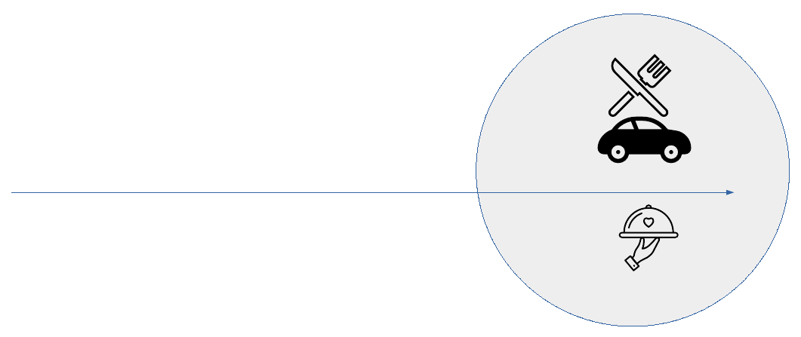

# 🌯 Karnel Kebab

> [!NOTE]
> Cette organisation a été créée dans le cadre d'un projet de cours entre `Infra` et `Dev`.

## 🏗️ Architecture du projet

Elle est composée de :
  - Un repo **Restaurant** qui simulera le comportement d'un restaurant avec une API en Node.js et Express.
  - Un repo **Bdd** pour la base de données de notre restaurant.
  - Un repo **API** Node.js et Express qui est le cœur du projet.

## 🚗 Le concept

> [!IMPORTANT]
> Le projet consiste à pouvoir commander à manger à bord de votre voiture grâce à un QR code. Votre commande sera automatiquement préparée lorsque votre voiture sera proche du restaurant !

### 📱 Étape 1 : Scanner & Commander

Vous êtes à bord de votre voiture et vous scannez le QR code :

> [!TIP]
> Passez votre commande tranquillement pendant votre trajet, le restaurant s'occupe du timing !

### 🍳 Étape 2 : Préparation en cours

Vous arrivez aux abords du restaurant et votre commande se prépare :

> [!WARNING]
> Assurez-vous que votre géolocalisation est activée pour que le restaurant détecte votre arrivée.

### ✅ Étape 3 : C'est prêt !

Vous arrivez devant le restaurant et votre plat est prêt :

**Bon appétit !** 🎉
